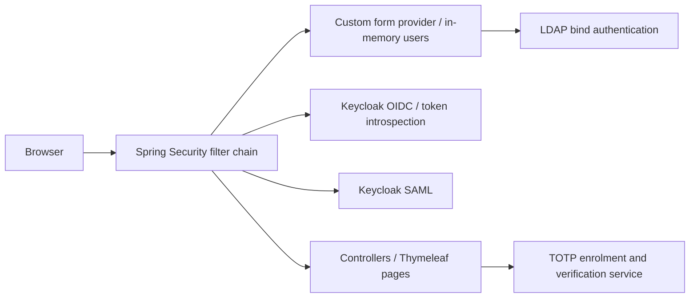
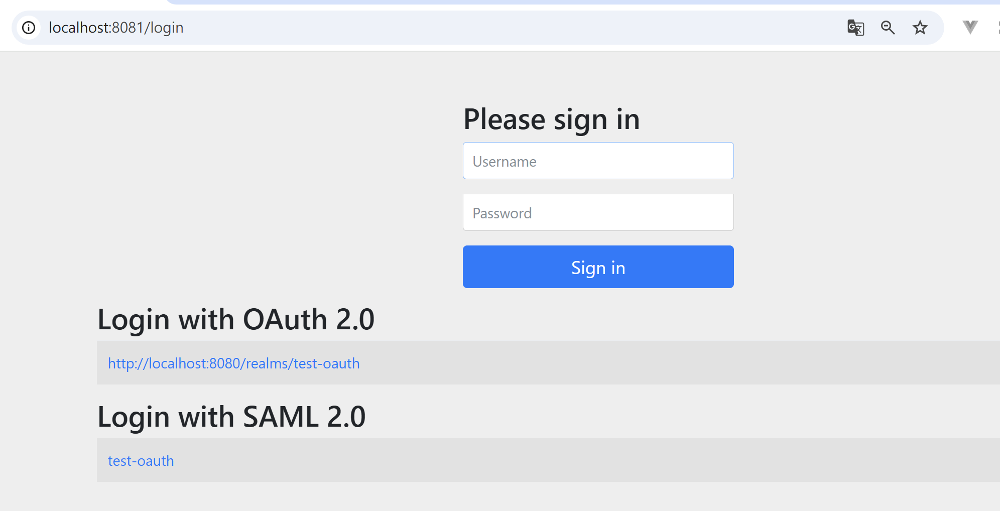
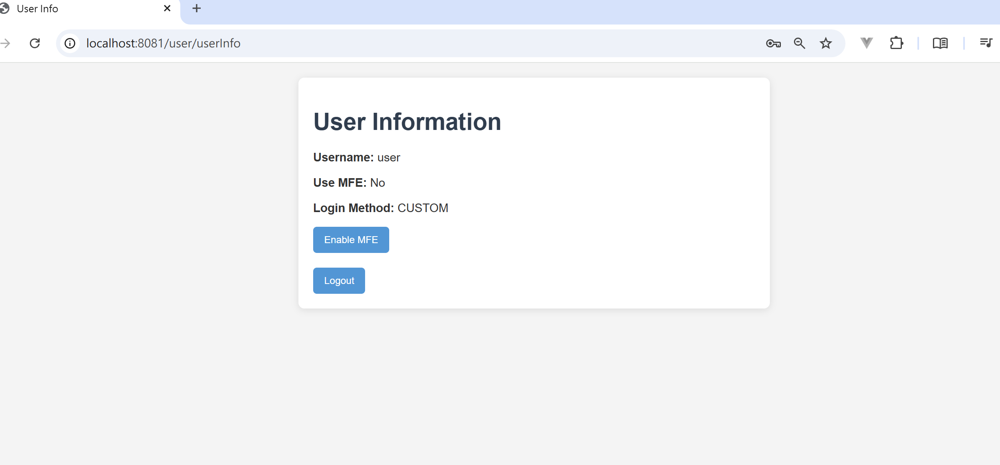
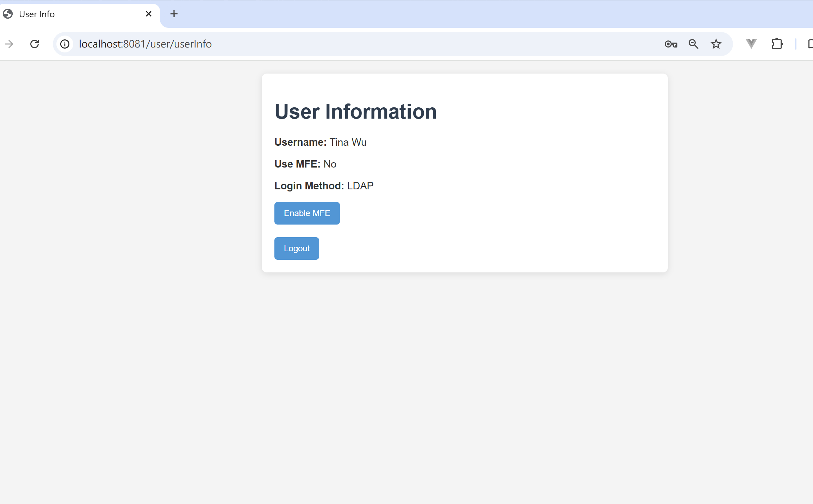
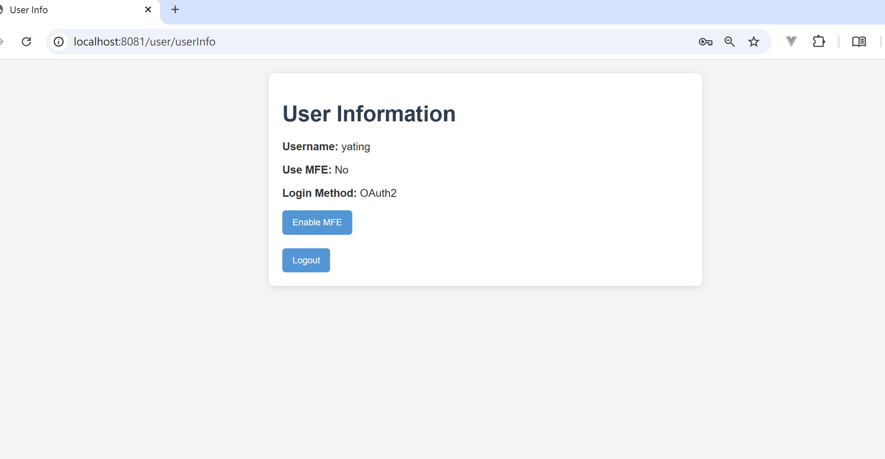
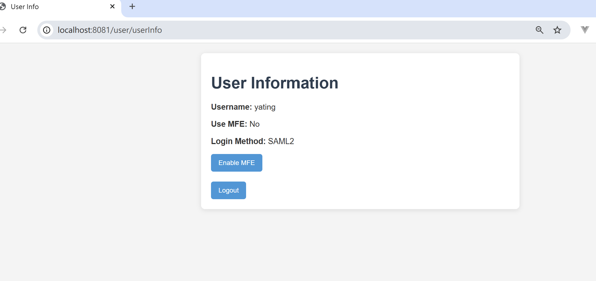
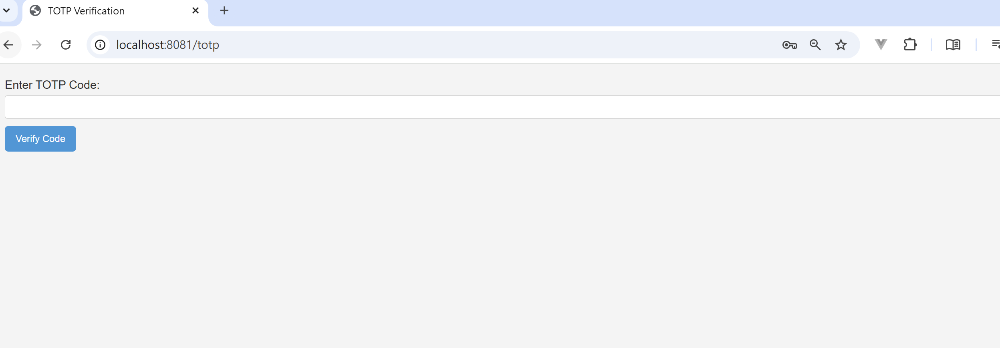

# Spring Security Demo

A learning project that explores several authentication methods in one Spring Boot application: local form login, LDAP, OpenID Connect (OIDC) with Keycloak, and SAML 2.0 with Keycloak. It also includes TOTP enrolment and verification screens for in-memory demo users.

The aim is to understand how Spring Security authentication providers, filters, success handlers and user principals work together. This is an integration demo, not a production security solution. The TOTP screens do not yet enforce second-factor completion across all protected routes.

## Implemented components

| Area | Implementation in this repository |
| --- | --- |
| Local form login | A custom authentication provider checks BCrypt passwords against an in-memory user map |
| LDAP login | The form provider attempts LDAP bind authentication when a local username is not found |
| OIDC login | Keycloak authorization-code login, with the `openid`, `profile` and `email` scopes |
| Token handling | Access and refresh token cookies, token introspection and a custom refresh filter |
| SAML login | Keycloak identity-provider metadata and a custom success handler that wraps the user principal |
| TOTP | Secret generation, a QR enrolment screen and code verification using Google Authenticator and ZXing |
| Logout | Session invalidation, token-cookie removal, Spring SAML logout configuration and a custom Keycloak logout handler |

Users and TOTP settings are stored in memory and reset when the application restarts. There is no database-backed account store. The presence of a login handler or screenshot does not establish that every login and logout flow is working with a newly configured identity provider.

## Technologies

- Java 17 and Maven
- Spring Boot 3.3.5
- Spring Security: form authentication, LDAP, OAuth2 client/resource server and SAML2 service provider
- Thymeleaf for server-rendered pages
- Keycloak for OIDC and SAML identity-provider integration
- OpenLDAP and phpLDAPadmin for the local LDAP environment
- Google Authenticator library and ZXing for TOTP and QR code generation

## Architecture



The diagram shows the configured components, rather than a guarantee that TOTP gates every request. Session and token handling coexist in the current implementation.

```text
src/main/java/com/yating/springsecurity/demo/
├── config/       # Filter chain, token filter, success handlers and logout
├── Provider/     # Local form authentication and LDAP configuration
├── controller/   # User pages, TOTP endpoints and diagnostic endpoints
├── service/      # In-memory users, TOTP and Keycloak token operations
├── dto/          # Custom users and authentication objects
├── enumeration/  # Login methods and token-cookie names
└── util/         # Token-cookie helpers
src/main/resources/
├── application.yaml # Environment-based connection and credential settings
├── dockerfile/      # Local LDAP Compose configuration
└── templates/       # Thymeleaf pages
docs/
├── local-setup.md    # Identity-provider and local credential setup
└── images/          # Saved demonstration screenshots
src/test/            # Existing Spring application-context smoke test
```

## Local setup

This application needs an available Keycloak realm and clients, an LDAP service, and a local SAML signing key/certificate. Credentials and private keys are not supplied in the repository.

See [local setup](docs/local-setup.md) for required environment variables, Docker commands and identity-provider settings.

From the repository root, after configuring those services and variables:

```sh
mvn spring-boot:run
```

The default application URL is `http://localhost:8081/login`.

```sh
mvn -DskipTests package  # Compile and package without running the context test
mvn test                # Run the existing test with the configured services available
```

The existing `contextLoads` test checks application-context startup; it does not verify authentication flows. Runtime verification requires the configured identity-provider environment.

## Demonstration screenshots

These screenshots were saved before the repository cleanup. Older screens use the label “MFE”; the current visible text uses “MFA”. The QR enrolment screenshot is excluded because it contains a TOTP provisioning secret.

| Login page | Local user |
| --- | --- |
|  |  |

| LDAP user | OIDC user |
| --- | --- |
|  |  |

| SAML user | TOTP verification screen |
| --- | --- |
|  |  |

## References

The original implementation used these tutorials:

- [Using Docker to set up LDAP](https://chrislee0728.medium.com/%E4%BD%BF%E7%94%A8-docker-%E5%BB%BA%E7%BD%AE-ldap-%E7%B3%BB%E7%B5%B1-82370c53bc9f)
- [Spring Boot with SAML2 and Keycloak](https://piotrminkowski.com/2024/10/28/spring-boot-with-saml2-and-keycloak/)
- [Implementing TOTP with Google Auth in Spring Boot](https://medium.com/@skarki2/implementing-totp-using-google-auth-in-spring-boot-70cc4381c5e1)

Configuration references:

- [Spring Boot 3.3 application properties](https://docs.spring.io/spring-boot/3.3/appendix/application-properties/index.html)
- [OpenLDAP container documentation](https://github.com/osixia/container-openldap)
- [phpLDAPadmin container documentation](https://github.com/osixia/docker-phpLDAPadmin)
